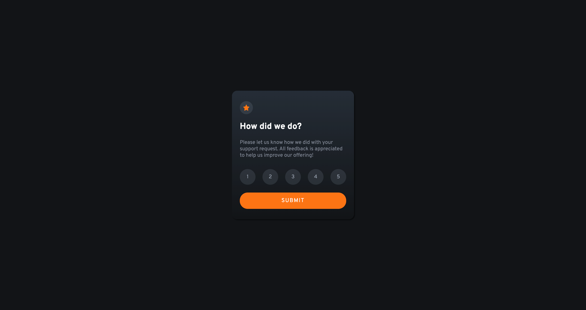
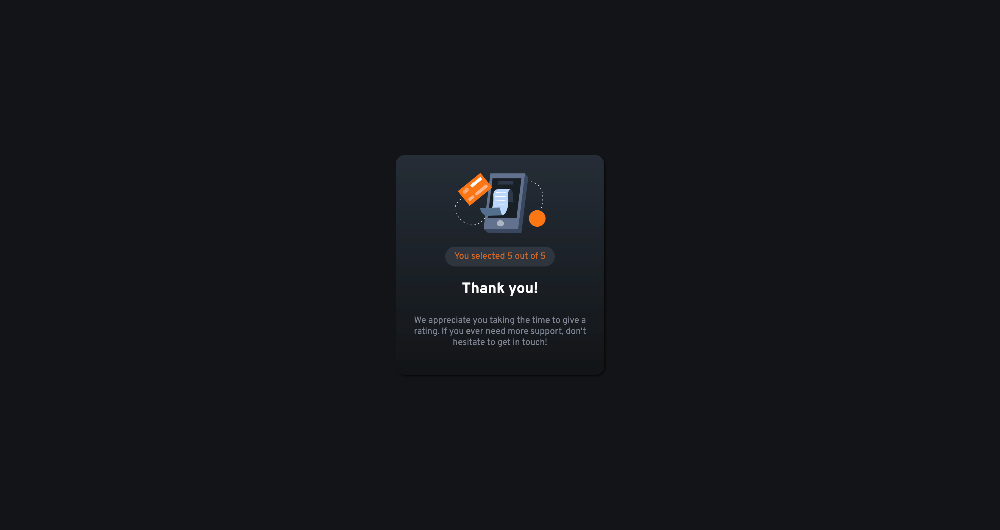
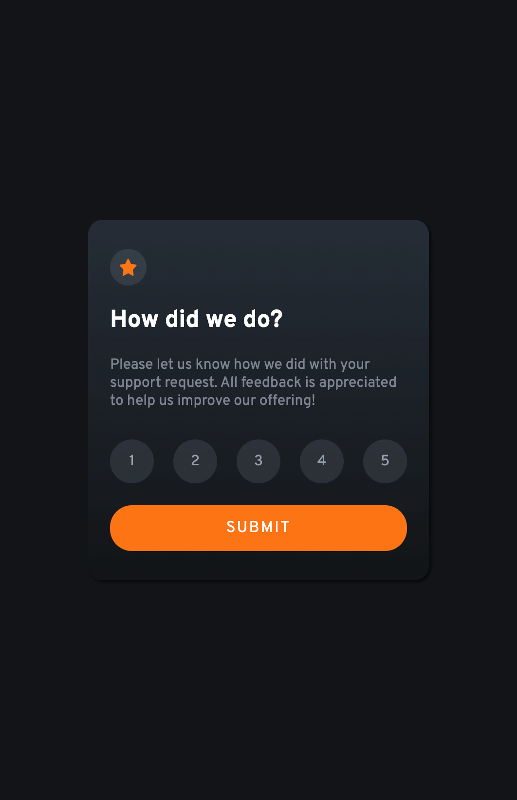
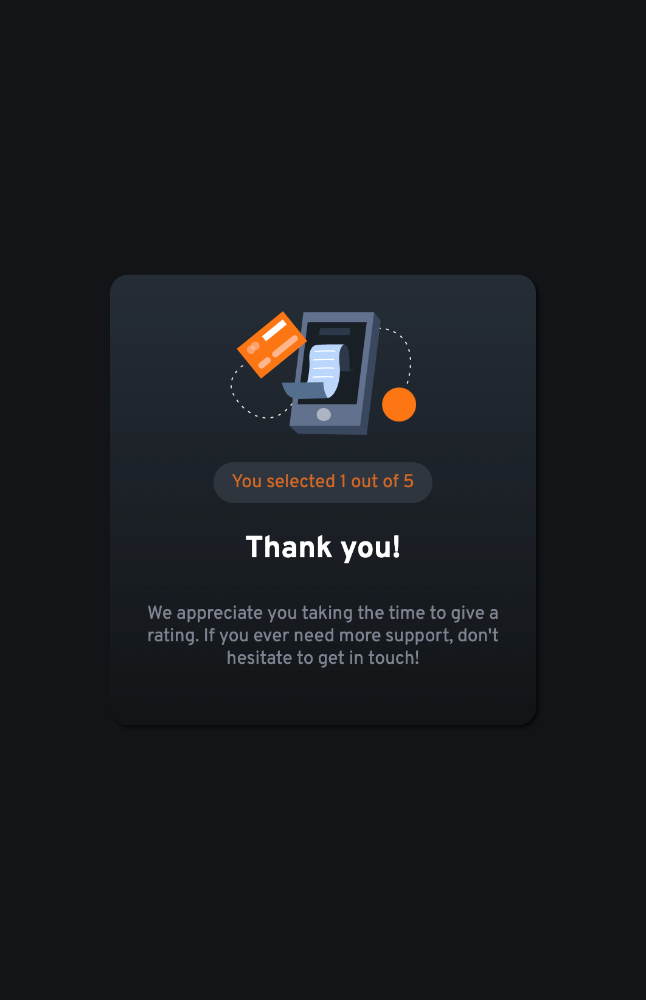

# Frontend Mentor - Interactive rating component solution

This is a solution to the [Interactive rating component challenge on Frontend Mentor](https://www.frontendmentor.io/challenges/interactive-rating-component-koxpeBUmI). Frontend Mentor challenges help you improve your coding skills by building realistic projects.

## Table of contents

- [Overview](#overview)
  - [The challenge](#the-challenge)
  - [Screenshot](#screenshot)
  - [Links](#links)
- [My process](#my-process)
  - [Built with](#built-with)
  - [What I learned](#what-i-learned)
  - [Continued development](#continued-development)
- [Author](#author)
- [Acknowledgments](#acknowledgments)

## Overview

### The challenge

Users should be able to:

- View the optimal layout for the app depending on their device's screen size
- See hover states for all interactive elements on the page
- Select and submit a number rating
- See the "Thank you" card state after submitting a rating

### Screenshot

(./screenshot_desktop-2_preview.png)




### Links

- Solution URL: [Add solution URL here](https://your-solution-url.com)
- Live Site URL: [Add live site URL here](https://your-live-site-url.com)

## My process

### Built with

- Semantic HTML5 markup
- CSS custom properties
- Flexbox
- Javascript

**Note: These are just examples. Delete this note and replace the list above with your own choices**

### What I learned

Use this section to recap over some of your major learnings while working through this project. Writing these out and providing code samples of areas you want to highlight is a great way to reinforce your own knowledge.

To see how you can add code snippets, see below:

```html
<div class="card">
  <section class="rating-container">
    <div class="icon-star">
      
    </div>
    <h1 class="title">How did we do?</h1>
    <p>
      Please let us know how we did with your support request. All feedback is
      appreciated to help us improve our offering!
    </p>
    <div class="rating">
      <ul>
        <li><button class="btn" type="button">1</button></li>
        <li><button class="btn" type="button">2</button></li>
        <li><button class="btn" type="button">3</button></li>
        <li><button class="btn" type="button">4</button></li>
        <li><button class="btn" type="button">5</button></li>
      </ul>
    </div>
    <button id="btn-submit" class="btn-submit" type="submit">Submit</button>
  </section>
  <section class="thanks-container hidden">
    
    <p class="rating-selected">
      You selected <span id="result"></span> out of 5
    </p>
    <h2 class="title">Thank you!</h2>
    <p>
      We appreciate you taking the time to give a rating. If you ever need more
      support, don't hesitate to get in touch!
    </p>
  </section>
</div>
```

```css
@import url("https://fonts.googleapis.com/css2?family=Overpass:wght@400;700&display=swap");
:root {
  --Orange: hsl(25, 97%, 53%);
  --White: hsl(0, 0%, 100%);
  --Light-Grey: hsl(217, 12%, 63%);
  --Medium-Grey: hsl(216, 12%, 54%);
  --Dark-Blue: hsl(213, 19%, 18%);
  --Very-Dark-Blue: hsl(216, 12%, 8%);
}
* {
  font-family: "Overpass", sans-serif;
  box-sizing: border-box;
  font-size: 15px;
  font-weight: 400;
  color: var(--White);
}
body {
  border: 0;
  margin: 0;
  min-height: 100dvh;
  display: flex;
  justify-content: center;
  align-items: center;
  background-color: var(--Very-Dark-Blue);
}
.card {
  max-width: 350px;
  height: auto;
  padding: 2rem 1.5em;
  border-radius: 1rem;
  background: linear-gradient(
    to bottom,
    var(--Dark-Blue),
    var(--Very-Dark-Blue)
  );
  box-shadow: 2px 2px 3px rgba(0, 0, 0, 0.65);
}
.hidden {
  display: none !important;
}
.icon-star {
  padding: 1rem;
  background-color: hsla(216, 12%, 54%, 0.2);
  position: relative;
  align-items: center;
  display: flex;
  justify-content: center;
  height: 2.5rem;
  width: 2.5rem;
  border-radius: 50%;
}
.icon-star img {
  width: 1.15rem;
  height: 1.15rem;
}
.title {
  color: inherit;
  font-size: 1.65rem;
  font-weight: 700;
}
.description {
  color: var(--Light-Grey);
}
.rating {
  margin-top: 2rem;
}
.rating ul {
  padding: 0;
  list-style: none;
  display: flex;
  justify-content: space-between;
}
.rating ul li button {
  color: var(--Light-Grey);
}
.btn {
  width: 3em;
  height: 3rem;
  position: relative;
  border-radius: 50%;
  border-style: none;
  background-color: hsla(216, 12%, 54%, 0.2);
}
.btn:hover {
  color: var(--White);
  cursor: pointer;
  transition: 0.5ms;
  background-color: var(--Light-Grey);
}
.active,
.btn:active {
  background-color: var(--Orange) !important;
  color: inherit !important;
  transition: color 0.5s, background-color 0.5s;
}
.btn-submit {
  border-style: none;
  color: var(--White);
  text-transform: uppercase;
  font-size: 16px;
  letter-spacing: 0.1rem;
  background-color: var(--Orange);
  width: 100%;
  border-radius: 1.5rem;
  padding: 0.9rem;
  margin-top: 0.5rem;
}
.btn-submit:hover,
.btn-submit:active {
  background-color: var(--White) !important;
  color: var(--Orange);
  transition: color 0.5s, background-color 0.5s;
  cursor: pointer;
}
.thanks-container {
  display: flex;
  flex-direction: column;
  align-items: center;
  text-align: center;
}
.thanks-container img {
  width: 50%;
  height: auto;
}
.rating-selected {
  color: var(--Orange);
  background-color: hsla(216, 12%, 54%, 0.2);
  font-weight: 400;
  margin-top: 1.5rem !important;
  padding: 0.5rem 1rem;
  border-radius: 2rem;
  color: hsla(25, 97%, 53%, 0.8) !important;
}
.rating-selected span {
  color: hsla(25, 97%, 53%, 0.8) !important;
}
.rating-selected p,
.thanks-container p,
.rating-container p {
  color: hsl(217, 12%, 63%, 0.8);
  font-weight: 400;
}
.thanks-container h2,
.thanks-container p,
.rating-container p {
  margin-top: 0.5rem;
}
```

```js
const ratingContainer = document.querySelector(".rating-container");
const thanksContainer = document.querySelector(".thanks-container");
const btnSubmit = document.getElementById("btn-submit");
const rates = document.querySelectorAll(".btn");
const result = document.getElementById("result");
const active = document.querySelector(".active");
let ratePoint = null;

rates.forEach((rate) => {
  rate.addEventListener("click", () => {
    console.log(`rating selected: ${rate.innerHTML}`);
    ratePoint = rate.innerHTML;
    result.innerHTML = ratePoint;
    activeClass();
    rate.classList.add("active");
  });
});

btnSubmit.addEventListener("click", () => {
  console.log(`click btn-submit`);
  if (ratePoint != null) {
    thanksContainer.classList.remove("hidden");
    ratingContainer.style.display = "none";
    console.log(`You selected ${ratePoint} out of 5`);
  }
});

function activeClass() {
  const active = document.querySelectorAll(".active");
  active.forEach((el) => {
    el.classList.remove("active");
  });
}
```

### Continued development

Use this section to outline areas that you want to continue focusing on in future projects. These could be concepts you're still not completely comfortable with or techniques you found useful that you want to refine and perfect.

## Author

- Frontend Mentor - [@yourusername](https://www.frontendmentor.io/profile/watt92imp)
- Twitter - [@yourusername](https://twitter.com/iWatt992)

## Acknowledgments

This is where you can give a hat tip to anyone who helped you out on this project. Perhaps you worked in a team or got some inspiration from someone else's solution. This is the perfect place to give them some credit.
